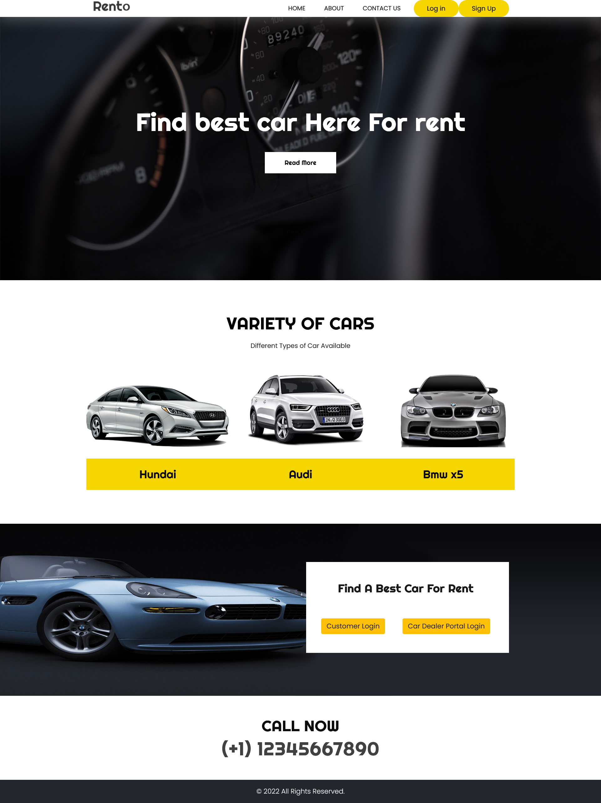

# Online Car Rental System
Online Car Rental System, a college project made with python language, django framework and SQLite as database.

## The structure of project 

  there are three modules (apps), one for car dealers, one for customers, one for the home page. Each app handles usual django things like models, urls and views.
  
## The system

  This is how the system works, car-dealer goes to the car_dealer_portal, signs up and uploads cars that he thinks are available for renting. Customer logs in to the customer_portal, enters the area at which he wants the car and the system scans through all the available car-dealers and their cars at that perticular area and shows the results to the customer. If the car is already rented by someone else it wont show up in the search results. 

### Home Page
